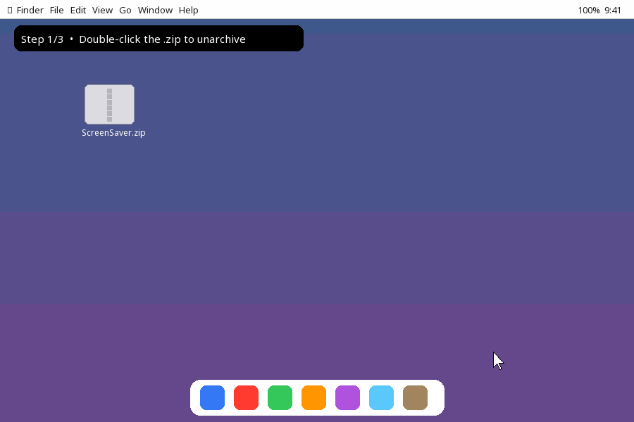

# Element Saver

A stunning animated periodic table screen saver for macOS.

## Download
See [Releases](https://github.com/zdiscov/element-saver-releases/releases) for the latest version.

## Install
1. Download `Element.Saver.zip` from Releases
2. Unzip
3. Double-click `Element Saver.saver` → click **Install**
4. Open **System Settings → Wallpaper** → select Element Saver

Requires macOS 13+. Notarized by Apple.
